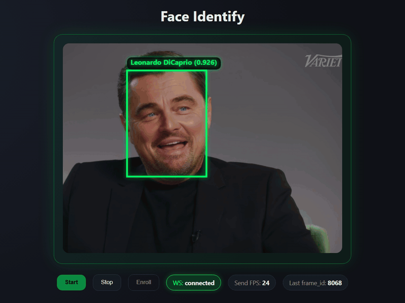

# FaceID - Real-Time Face Recognition

A lightweight **real-time face recognition system** built with
**FastAPI**, **WebSockets**, and **InsightFace**, designed for
low-latency streaming inference directly from the browser.

The project provides two interactive web clients:

-   **Identify Mode** --- detect and recognize faces in real time
-   **Enroll Mode** --- register new identities through live webcam
    capture

The system uses **ONNXRuntime GPU acceleration** and streams frames
through **WebSockets**, enabling fast inference without heavy frontend
frameworks.

## 🎥 Live Demo

<p align="center">
  
</p>

<p align="center">
Real-time face detection and recognition streaming from the browser.
</p>

------------------------------------------------------------------------

## Demo Architecture

    Browser (Webcam)
           │
           │ JPEG frames via WebSocket
           ▼
    FastAPI WebSocket Server
           │
           │ Face detection + embedding
           ▼
    InsightFace / ONNXRuntime (GPU)
           │
           ▼
    Identity Matching (1:N)
           │
           ▼
    JSON results → Browser overlay

------------------------------------------------------------------------

## Features

-   Real-time face detection
-   Face recognition (1:N matching)
-   WebSocket streaming pipeline
-   GPU acceleration via ONNXRuntime
-   Simple browser UI (no frameworks)
-   Interactive enrollment system
-   Persistent embedding storage
-   Dockerized backend
-   Clean modular Python architecture

------------------------------------------------------------------------

## Project Structure

    face-id
    │
    ├─ .docker
    │  ├─ .dockerignore
    │  ├─ app.dockerfile
    │  ├─ compose.yml
    │  ├─ frontend.dockerfile
    ├─ app
    │  ├─ config
    │  ├─ controllers
    │  ├─ helpers
    │  ├─ models
    │  ├─ services
    │  ├─ repositories
    │  └─ __init__.py
    │
    ├─ frontend
    │  ├─ index.html
    │  ├─ enroll.html
    │  └─ styles.css
    │
    ├─ db
    │  ├─ templates.npz
    │  └─ templates.json
    │
    ├─ pyproject.toml
    ├─ requirements.txt
    └─ run.sh

------------------------------------------------------------------------

## Installation

### Clone repository

``` bash
git clone https://github.com/your-user/face-id.git
cd face-id
```

------------------------------------------------------------------------

## Run with Docker (Recommended)

Requires **NVIDIA Container Toolkit**.

``` bash
docker compose -f .docker/compose.yml up -d
```

Server will start at:

    http://localhost:8081

Frontend will start at:

    http://localhost:80

------------------------------------------------------------------------

## Frontend

Open the frontend files directly or host them via nginx.

### Identify mode

    frontend/index.html

Streams webcam frames and performs **real-time recognition**.

### Enroll mode

    frontend/enroll.html

Allows capturing samples and registering a new identity.

------------------------------------------------------------------------

## WebSocket Endpoints

### Identify

    ws://localhost:8081/ws/identify

Receives JPEG frames and returns detected faces.

Example response:

``` json
{
  "frame_id": 123,
  "faces": [
    {
      "bbox": [120, 80, 260, 240],
      "name": "marcio",
      "score": 0.82
    }
  ]
}
```

------------------------------------------------------------------------

### Enroll

    ws://localhost:8081/ws/enroll?name=<identity>

Collects samples and registers a new face template.

Workflow:

    start → capture samples → commit → store template

------------------------------------------------------------------------

## Recognition Pipeline

1.  Receive frame
2.  Decode JPEG
3.  Face detection
4.  Face alignment
5.  Feature embedding extraction
6.  Cosine similarity vs template database
7.  Return best match

------------------------------------------------------------------------

## Technologies

Backend:

-   FastAPI
-   WebSockets
-   InsightFace
-   ONNXRuntime GPU
-   OpenCV
-   NumPy

Frontend:

-   Vanilla HTML
-   Canvas API
-   WebSocket API

Infrastructure:

-   Docker
-   NVIDIA CUDA
-   cuDNN

------------------------------------------------------------------------

## Future Improvements

-   Face clustering
-   Multiple identities per user
-   Liveness detection
-   Vector database integration
-   WebRTC streaming
-   Mobile support

------------------------------------------------------------------------

## Author

**Marcio Martinez**

Senior Software Engineer\
Cloud • Distributed Systems • Computer Vision

LinkedIn:

    https://linkedin.com/in/marcio-martinez

------------------------------------------------------------------------

## License

MIT
